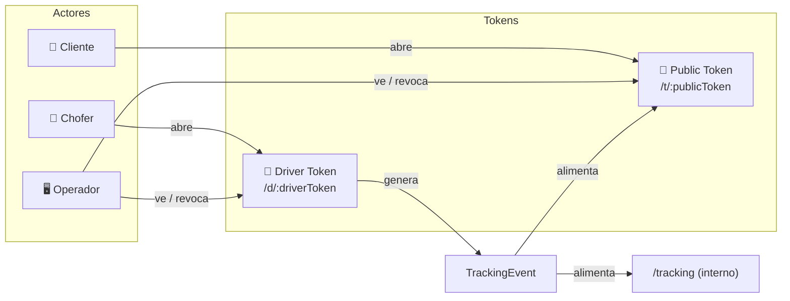
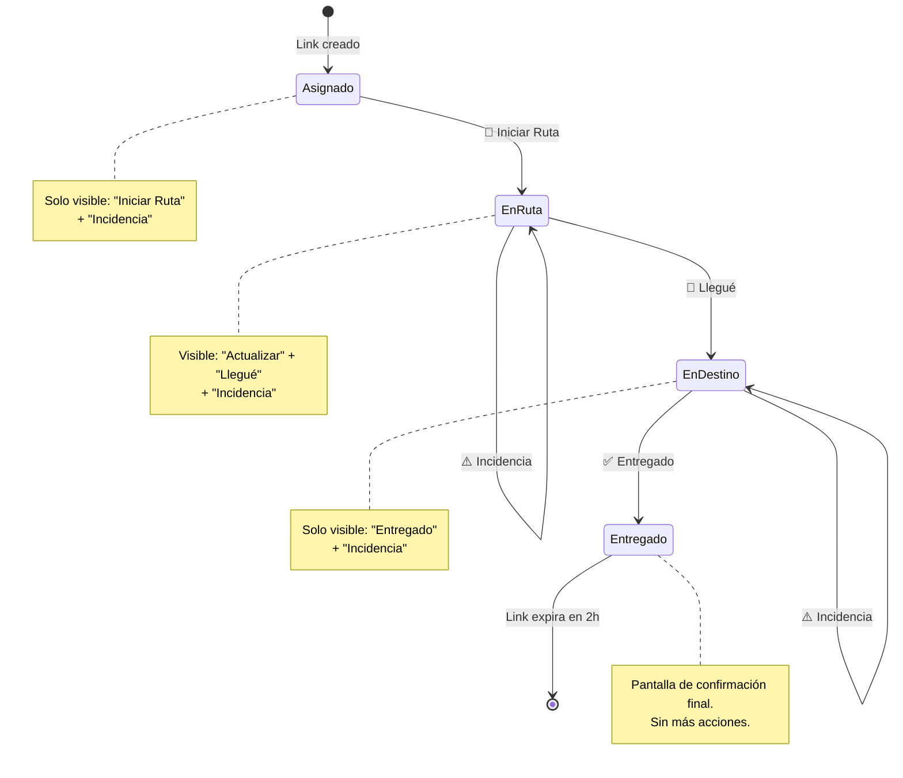

# Mini-Web para Choferes — Especificación de Diseño
> Versión: 1.0 · Fecha: 2026-02-23 · Estado: **BORRADOR**
> Módulo: OPS_TRACK · Dependencias: TRACKING_SECURITY.md, TRACKING_BACKEND_BLUEPRINT.md

---

## 1. Visión General

El **Driver Mini-Web** es una webapp mobile-first de **una sola pantalla** que el chofer abre desde un link SMS/WhatsApp. No requiere instalación, login, ni acceso al ERP. Cada acción del chofer genera un `TrackingEvent` que alimenta tanto la vista interna (`/tracking`) como la pública (`/t/:token`).



---

## 2. Ruta y Layout

| Propiedad | Valor |
|-----------|-------|
| **Ruta** | `/d/:driverToken` |
| **Layout** | **SIN** `AppLayout`. Pantalla completa standalone, similar a `/t/:token`. |
| **Responsive** | Mobile-first. Usable en pantallas ≥320px. Opcional desktop. |
| **PWA** | No requerido en v1. Meta tag `viewport` + `theme-color` para barra nativa limpia. |
| **Orientación** | Portrait forzado (meta tag). |

> [!IMPORTANT]
> La ruta usa `/d/` (de *driver*) para separación clara de `/t/` (tracking público). Los tokens son distintos e independientes.

---

## 3. Pantallas

### 3.1 Pantalla Principal — `DriverDashboard`

Una sola pantalla con 3 zonas verticales:

```
┌─────────────────────────────┐
│  HEADER (branding + orden)  │
├─────────────────────────────┤
│                             │
│  RESUMEN DE OPERACIÓN       │
│  • Referencia de orden      │
│  • Ruta (origen → destino)  │
│  • Estatus actual (Badge)   │
│  • ETA                      │
│                             │
├─────────────────────────────┤
│                             │
│  BOTONES DE ACCIÓN          │
│  (contextuales al estatus)  │
│                             │
│  ┌─────────────────────┐    │
│  │  🚚  Iniciar Ruta   │    │
│  └─────────────────────┘    │
│  ┌─────────────────────┐    │
│  │  📍 Actualizar Ubic │    │
│  └─────────────────────┘    │
│  ┌─────────────────────┐    │
│  │  🏁 Llegué/Entregué │    │
│  └─────────────────────┘    │
│  ┌─────────────────────┐    │
│  │  ⚠️ Incidencia      │    │
│  └─────────────────────┘    │
│                             │
├─────────────────────────────┤
│  ÚLTIMO EVENTO REGISTRADO   │
│  (mini-timeline: 1-2 items) │
└─────────────────────────────┘
```

### 3.2 Modal de Confirmación — `ActionConfirmModal`

Se abre al presionar cualquier botón de acción. Contenido:

```
┌─────────────────────────────┐
│  ❓ ¿Confirmar acción?      │
│                             │
│  Acción: "Iniciar Ruta"     │
│  Ubicación: Obteniendo...   │
│    → Nuevo Laredo, Tamps.   │    ← resultado de GPS + geocode
│  Hora: 14:32 CST            │
│                             │
│  ┌──────────┐ ┌───────────┐ │
│  │ Cancelar │ │ Confirmar │ │
│  └──────────┘ └───────────┘ │
└─────────────────────────────┘
```

### 3.3 Modal de Incidencia — `IncidentModal`

Se abre al presionar "Reportar Incidencia":

```
┌─────────────────────────────┐
│  ⚠️ Reportar Incidencia     │
│                             │
│  Tipo: [dropdown]           │
│    • Retraso en aduana      │
│    • Avería mecánica        │
│    • Accidente              │
│    • Cierre de carretera    │
│    • Otro                   │
│                             │
│  Nota (opcional):           │
│  ┌─────────────────────┐    │
│  │                     │    │
│  └─────────────────────┘    │
│                             │
│  ┌──────────┐ ┌───────────┐ │
│  │ Cancelar │ │  Enviar   │ │
│  └──────────┘ └───────────┘ │
└─────────────────────────────┘
```

### 3.4 Pantalla de Error / Token Inválido

Reutiliza el patrón de `TrackingPublicPage`: pantalla centrada con ícono + mensaje.

| Caso | Ícono | Mensaje |
|------|-------|---------|
| Token inexistente | `AlertTriangle` | "Este enlace de operador no existe." |
| Token expirado | `Clock` | "Tu acceso a esta operación ha terminado." |
| Token revocado | `Shield` | "Este enlace fue desactivado." |

---

## 4. Especificación de Eventos

### 4.1 Mapeo Acción → TrackingEvent

| Acción del Chofer | `eventType` | `source` | Requiere GPS | Genera evento público | Notas |
|---|---|---|---|---|---|
| **Iniciar Ruta** | `departure` | `driver` | ✅ Obligatoria | ✅ Sí: "Salida de Almacén" | Solo permitido si estatus actual es `pending` o `assigned`. Transición a `in_transit`. |
| **Actualizar Ubicación** | `in_transit` | `driver` | ✅ Obligatoria | ✅ Sí: "En camino — [Municipio], [Estado]" | Sujeto a reglas anti-ruido (§5). |
| **Llegué / En Entrega** | `arrival` | `driver` | ✅ Obligatoria | ✅ Sí: "En punto de entrega" | Transición a estatus `at_destination`. |
| **Entregado** | `delivered` | `driver` | ⚡ Opcional | ✅ Sí: "Entregado en [Municipio]" | Transición final. Inicia countdown post-entrega para link público (EXP-05). |
| **Reportar Incidencia** | `incident` | `driver` | ⚡ Opcional | ⚠️ Condicional | Solo muestra "Retraso reportado" en público. **Nunca** el detalle. |

### 4.2 Estructura del evento generado

```typescript
// Payload que envía el frontend del chofer al backend
interface DriverEventPayload {
  driverToken: string;       // UUID del token del chofer
  action: 'departure' | 'in_transit' | 'arrival' | 'delivered' | 'incident';
  location?: {
    lat: number;             // Precisión completa del GPS del dispositivo
    lng: number;
    accuracy?: number;       // metros, del API del navegador
  };
  incident?: {
    type: 'customs_delay' | 'mechanical' | 'accident' | 'road_closure' | 'other';
    note?: string;           // máximo 280 caracteres
  };
  clientTimestamp: string;   // ISO 8601 — hora del dispositivo
}
```

### 4.3 Evento resultante en BD (`tracking_events`)

```typescript
// Lo que el backend persiste (agrega campos server-side)
{
  id: uuid,                  // gen_random_uuid()
  tenant_id: uuid,           // derivado del driver_link → order → tenant
  order_id: uuid,            // derivado del driver_link → order
  event_type: string,        // del payload.action
  location_lat: numeric,     // del payload.location.lat (exacto)
  location_lng: numeric,     // del payload.location.lng (exacto)
  municipality: string,      // reverse geocode server-side
  state_name: string,        // reverse geocode server-side
  country_code: 'MX',
  source: 'driver',          // siempre 'driver' para este flujo
  recorded_at: timestamptz,  // NOW() del servidor, no del cliente
  metadata: jsonb            // { accuracy, clientTimestamp, incidentType, note }
}
```

> [!NOTE]
> El `recorded_at` siempre usa la hora del **servidor**, no la del dispositivo. La hora del cliente se guarda en `metadata` para auditoría de discrepancia.

---

## 5. Controles Anti-Ruido

Reutiliza las reglas ya definidas en `trackingGeo.service.ts` (`shouldGenerateEvent`), aplicándolas **server-side**.

### 5.1 Reglas para `in_transit` (Actualizar Ubicación)

| Regla | Parámetro | Valor | Comportamiento |
|-------|-----------|-------|----------------|
| **DEDUP-01** Municipio duplicado | — | — | Si el municipio resultante del geocode es igual al del último evento, **rechazar** silenciosamente (200 OK + `{ accepted: false, reason: "same_municipality" }`). |
| **DEDUP-02** Cooldown | `cooldownMinutes` | **30 min** | Si el último evento `in_transit` fue hace < 30 min, rechazar con `{ accepted: false, reason: "cooldown", retryAfterMinutes: N }`. |
| **DEDUP-03** Anti-GPS-jump | `minDistanceKm` | **2 km** | Si la distancia Haversine al último punto es < 2 km y el municipio no cambió, rechazar. |
| **DEDUP-04** Límite diario | — | **20 eventos/orden/día** | Hard cap para prevenir spam. |

### 5.2 Reglas para otros tipos de evento

| `eventType` | Anti-ruido | Motivo |
|---|---|---|
| `departure` | Solo 1 por orden | Una vez iniciada la ruta, no se puede volver a "Iniciar". |
| `arrival` | Solo 1 por orden | "Llegué" solo se emite una vez. |
| `delivered` | Solo 1 por orden | Entrega es terminal. |
| `incident` | Cooldown 10 min entre incidencias | Prevenir spam, pero permitir múltiples si son legítimas. |

### 5.3 Sin permisos de ubicación (GPS)

| Acción | GPS obligatorio | Comportamiento sin GPS |
|---|---|---|
| Iniciar Ruta | ✅ Sí | **Bloqueado.** Mostrar diálogo: "Necesitamos tu ubicación para iniciar. Activa la ubicación en tu navegador." + botón "Reintentar". |
| Actualizar Ubicación | ✅ Sí | **Bloqueado.** Mismo diálogo. |
| Llegué/En Entrega | ✅ Sí | **Bloqueado.** Mismo diálogo. Importancia: valida proximidad al destino. |
| Entregado | ⚡ Opcional | **Permitido sin GPS.** Guardar `location = null`, registrar en metadata `{ gps_denied: true }`. Justificación: no bloquear el cierre de operación por un permiso del navegador. |
| Incidencia | ⚡ Opcional | **Permitido sin GPS.** Igual que "Entregado". |

> [!WARNING]
> Si el navegador devuelve `PositionError.PERMISSION_DENIED`, no re-pedir automáticamente. Mostrar instrucciones visuales de cómo habilitar ubicación en iOS Safari / Android Chrome.

---

## 6. Seguridad del Token del Chofer

### 6.1 Diferenciación de tokens

| Concepto | Token Público (`/t/:token`) | Token Chofer (`/d/:driverToken`) |
|---|---|---|
| **Propósito** | Ver tracking (read-only) | Reportar eventos (write) |
| **Actor** | Cliente / cualquiera con el link | Chofer asignado |
| **Permisos** | Solo lectura de `PublicTrackingView` sanitizada | Escritura de `TrackingEvent` + lectura de `DriverView` |
| **Generación** | Al crear link para compartir | Al asignar chofer a la orden |
| **Relación** | Independientes. No derivables uno del otro. | Independientes. |

> [!CAUTION]
> **Nunca** derivar un token del otro (ej: hash del token público). Si un token se filtra, el otro permanece seguro.

### 6.2 Tabla propuesta: `driver_links`

Tabla separada de `tracking_links` para aislamiento completo.

| Columna | Tipo | Restricciones | Descripción |
|---|---|---|---|
| `id` | `uuid` | PK | — |
| `tenant_id` | `uuid` | NOT NULL, FK → `tenants.id` | Multi-tenant |
| `order_id` | `uuid` | NOT NULL, FK → `orders.id` | — |
| `driver_token` | `uuid` | NOT NULL, UNIQUE | Token opaco para la URL |
| `driver_name` | `text` | NOT NULL | Nombre del chofer (solo para display interno) |
| `state` | `text` | CHECK(`active`,`expired`,`revoked`) | Ciclo de vida |
| `expires_at` | `timestamptz` | NOT NULL | Default: `fecha_entrega_estimada + 24h` |
| `revoked_at` | `timestamptz` | NULLABLE | — |
| `created_at` | `timestamptz` | NOT NULL, default `now()` | — |
| `last_used_at` | `timestamptz` | NULLABLE | Última acción registrada |

### 6.3 Expiración y revocación

| Regla | Descripción |
|---|---|
| **DEXP-01** | TTL por defecto: ETA del pedido + 24 horas. |
| **DEXP-02** | TTL máximo configurable: 7 días (operaciones largas). |
| **DEXP-03** | Al marcar `delivered`, el link expira en **2 horas** (gracia para correcciones). |
| **DEXP-04** | Revocación manual por `ops_coordinator` u `ops_director`, irreversible. |
| **DEXP-05** | Un solo `driver_link` activo por `order_id` en cualquier momento. |

### 6.4 Datos visibles para el chofer vs. el cliente

| Dato | Chofer (`/d/`) | Cliente (`/t/`) | Operador ERP |
|---|---|---|---|
| Referencia de orden (`ROT-24-001`) | ✅ | ✅ | ✅ |
| Ruta (Laredo → MTY) | ✅ | ✅ | ✅ |
| Estatus actual | ✅ | ✅ | ✅ |
| ETA | ✅ | ✅ | ✅ |
| **Nombre del cliente** | ✅ solo primer nombre | ❌ | ✅ |
| **Dirección destino** | ✅ ciudad + colonia | ❌ | ✅ |
| **Teléfono del cliente** | ❌ | ❌ | ✅ |
| **Historial de eventos** | Solo últimos 3 | Timeline completo | Completo |
| **Coordenadas exactas** | Solo las propias | Redondeadas (2 dec) | Exactas |
| UUIDs internos | ❌ | ❌ | ✅ |
| Datos fiscales | ❌ | ❌ | ✅ |

---

## 7. Flujo del Chofer — Máquina de Estados



### 7.1 Botones visibles por estado

| Estado actual | Iniciar Ruta | Actualizar Ubic. | Llegué | Entregado | Incidencia |
|---|---|---|---|---|---|
| `assigned` | ✅ **Primario** | ❌ | ❌ | ❌ | ✅ Secundario |
| `in_transit` | ❌ | ✅ **Primario** | ✅ Secundario | ❌ | ✅ Secundario |
| `at_destination` | ❌ | ❌ | ❌ | ✅ **Primario** | ✅ Secundario |
| `delivered` | ❌ | ❌ | ❌ | ❌ | ❌ |

> El botón **Primario** es el más grande y prominente. Los secundarios son más discretos.

---

## 8. Flujo Backend de una Acción

```
POST /api/driver/event

[1] VALIDAR TOKEN
    SELECT dl.*, o.id, o.ref, o.current_status, o.tenant_id
    FROM driver_links dl
    JOIN orders o ON o.id = dl.order_id
    WHERE dl.driver_token = :driverToken
    → 404 si no existe
    → 410 si expired / revoked

[2] VALIDAR TRANSICIÓN DE ESTADO
    Verificar que action sea válida para o.current_status (§7.1)
    → 409 Conflict si transición inválida

[3] OBTENER UBICACIÓN DEL PAYLOAD
    → Si GPS obligatorio y no enviado: 422 { error: "location_required" }

[4] REVERSE GEOCODE (server-side)
    Si location presente: llamar geocode → (municipality, state_name)
    → Si falla: municipality = null (no bloquear el evento)

[5] APLICAR ANTI-RUIDO (solo para in_transit)
    shouldGenerateEvent(incomingLocation, incomingPlace, lastEvent, config)
    → Si rechazado: 200 { accepted: false, reason: "..." }

[6] PERSISTIR EVENTO
    INSERT INTO tracking_events (...)

[7] ACTUALIZAR ESTATUS DE ORDEN (si aplica)
    departure  → UPDATE orders SET current_status = 'in_transit'
    arrival    → UPDATE orders SET current_status = 'at_destination'
    delivered  → UPDATE orders SET current_status = 'delivered', delivered_at = NOW()

[8] ACTUALIZAR driver_links.last_used_at
    UPDATE driver_links SET last_used_at = NOW()

[9] RESPONDER
    200 { accepted: true, eventId: "evt-N", place: "Sabinas Hidalgo, N.L." }
```

---

## 9. Checklist de Casos Borde

### GPS y Conectividad

| # | Caso | Comportamiento esperado |
|---|------|------------------------|
| CB-01 | GPS denegado en "Iniciar Ruta" | Bloquear acción. Mostrar instrucciones para habilitar GPS. |
| CB-02 | GPS denegado en "Entregado" | Permitir sin ubicación. Registrar `gps_denied: true`. |
| CB-03 | GPS con accuracy > 500m | Aceptar pero registrar en metadata. Alerta visual: "Ubicación aproximada". |
| CB-04 | Sin conexión a internet | Mostrar "Sin conexión. Reintenta cuando tengas señal." **No** implementar cola offline en v1. |
| CB-05 | Timeout de GPS (>15s) | Abandonar geolocalización. Para acciones opcionales, proceder sin GPS. Para obligatorias, mostrar "No pudimos obtener tu ubicación". |

### Tokens y Sesión

| # | Caso | Comportamiento esperado |
|---|------|------------------------|
| CB-06 | Token de chofer expirado | Pantalla de error: "Tu acceso a esta operación ha terminado." |
| CB-07 | Token revocado mid-session | Al siguiente POST: 410. UI muestra "Este enlace fue desactivado." |
| CB-08 | Dos choferes con mismo token | No posible (UNIQUE constraint). La rotación revoca el anterior. |
| CB-09 | Chofer abre link después de `delivered` | Pantalla read-only: "Esta operación fue completada." + resumen final. |

### Transiciones Inválidas

| # | Caso | Comportamiento esperado |
|---|------|------------------------|
| CB-10 | "Actualizar Ubicación" sin haber iniciado ruta | Botón no visible (§7.1). Si forzado vía API: 409 Conflict. |
| CB-11 | "Entregado" sin haber presionado "Llegué" | Botón no visible. 409 si forzado. |
| CB-12 | Doble-tap en "Iniciar Ruta" | Debounce de 3s en botón. Si llega duplicado al server: idempotente (detectar `departure` existente, responder 200 sin duplicar). |
| CB-13 | "Entregado" presionado lejos del destino (>50km) | ⚠️ v1: aceptar con warning en metadata `{ far_from_destination: true }`. El operador decide si re-abrir. |

### Anti-Ruido

| # | Caso | Comportamiento esperado |
|---|------|------------------------|
| CB-14 | 5 updates seguidos desde el mismo municipio | Solo el primero se acepta. Los demás: `{ accepted: false, reason: "same_municipality" }`. |
| CB-15 | Update a los 10 minutos del anterior | Rechazado por cooldown (30 min). Mostrar al chofer: "Podrás actualizar en 20 min." |
| CB-16 | GPS fluctúa 500m sin cambio de municipio | Rechazado por DEDUP-03 (< 2km). |
| CB-17 | Geocode falla (Nominatim timeout) | Aceptar el evento **sin** municipio. Marcar `municipality = null`. Re-intentar geocode async. |

---

## 10. Resumen de Artefactos a Crear

| Artefacto | Tipo | Descripción |
|-----------|------|-------------|
| `driver_links` | Tabla (migración) | Almacena tokens de choferes. Separada de `tracking_links`. |
| `DriverPublicPage.tsx` | Página React | Pantalla principal del mini-web del chofer. Ruta: `/d/:driverToken`. |
| `ActionConfirmModal.tsx` | Componente | Modal de confirmación con preview de GPS + geocode. |
| `IncidentModal.tsx` | Componente | Modal de selección de incidencia. |
| `POST /api/driver/event` | Endpoint (Edge Fn) | Recibe acciones, valida, genera evento, actualiza orden. |
| `driverLink.service.ts` | Servicio frontend | Mock → real. Wrapper sobre el endpoint. |
| `tracking.mock.ts` | Update | Añadir mocks de `driver_links` + `getMockDriverView()`. |
| `router.tsx` | Update | Agregar ruta `/d/:driverToken` sin `AppLayout`. |

---

*Documento de especificación. Sin código de implementación.*
