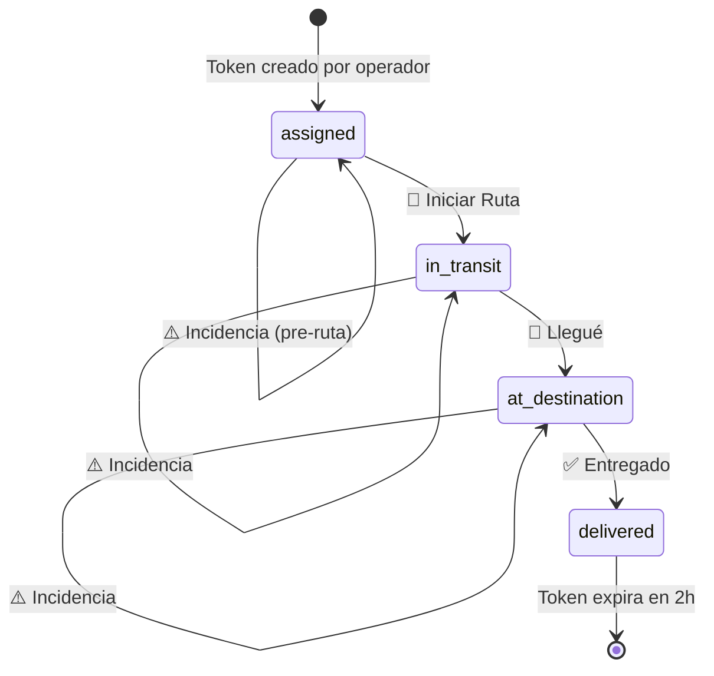

# Mini-Web para Choferes — Especificación v2
> Versión: 2.0 · Fecha: 2026-02-23 · Estado: **BORRADOR**
> Módulo: OPS_TRACK · Opción A: Ubicación por Evento
> Supersede: DRIVER_MINIWEB_SPEC.md (v1)
> Referencias: TRACKING_SECURITY.md · TRACKING_BACKEND_BLUEPRINT.md · TRACKING_TOKEN_SCHEMA.md

---

## 0. Cambios vs v1

| Área | v1 | v2 (este documento) |
|------|----|----|
| GPS fallback | "Bloqueado" para acciones obligatorias | Flujo de 3 niveles: GPS → reintentar → enviar sin ubicación / selección manual |
| Offline | "No implementar cola offline" | Cola en `localStorage` con sync automático al recuperar red |
| Anti-ruido | Definido pero sin N concreto | N = **15** eventos `in_transit` por viaje, con justificación |
| Token | Tabla separada `driver_links` | Tabla unificada `tracking_tokens` con `scope` (ref: TRACKING_TOKEN_SCHEMA) |
| Batería baja | No cubierto | Recomendaciones operativas y técnicas |

---

## 1. Visión General

El **Driver Mini-Web** es una webapp mobile-first de **una sola pantalla** que el chofer accede desde un link SMS/WhatsApp. Sin instalación, sin login, sin acceso al ERP. Cada acción del chofer genera un `TrackingEvent` que alimenta tanto la vista interna (`/tracking`) como la pública (`/t/:token`).

```
  OPERADOR (ERP)                  CHOFER (celular)               CLIENTE (link)
  ┌────────────┐                  ┌──────────────┐               ┌────────────┐
  │ /tracking   │──crea token──► │ /d/:token     │               │ /t/:token  │
  │ ve timeline │                 │ presiona      │──genera──►    │ ve mapa    │
  │ revoca link │                 │ botón acción  │  TrackingEvent│ ve timeline│
  └────────────┘                  └──────────────┘               └────────────┘
```

---

## 2. Ruta y Layout

| Propiedad | Valor |
|-----------|-------|
| **Ruta** | `/d/:driverToken` |
| **Layout** | **SIN** `AppLayout`. Pantalla completa standalone. |
| **Responsive** | Mobile-first. Funcional desde 320px. |
| **PWA** | No en v1. Meta `viewport` + `theme-color` + `apple-mobile-web-app-capable`. |
| **Orientación** | Portrait preferido (meta tag). |

---

## 3. Token del Chofer

> Decisión completa documentada en **TRACKING_TOKEN_SCHEMA.md**. Resumen ejecutivo aquí.

| Decisión | Valor |
|----------|-------|
| Generación | UUID v4 independiente (`crypto.randomUUID()`). Sin relación con el token público. |
| Tabla | `tracking_tokens` con `scope = 'driver:write'` |
| Scope | `driver:write` → puede leer su `DriverView` y crear eventos para su orden |
| Permisos denegados | No puede: leer datos de otros pedidos, revocar tokens, ver coordenadas de terceros |
| TTL default | ETA del pedido + 24h |
| TTL post-entrega | `delivered_at + 2h` (gracia para correcciones) |
| TTL máximo | 7 días |
| Revocación | Manual por ops (irreversible), o automática al rotar chofer |
| Unicidad | Solo UN token `driver:write` activo por `order_id` |
| Scope-blind | Si se presenta en `/api/track/` (endpoint público): responde 404, no 403 |

---

## 4. Pantallas del Mini-Web

### 4.1 Pantalla Principal — `DriverDashboard` (1 sola pantalla)

```
┌──────────────────────────────────┐
│  HEADER                          │
│  Rotero · Seguimiento Activo     │
├──────────────────────────────────┤
│                                  │
│  RESUMEN DE OPERACIÓN            │
│  ┌──────────────────────────┐    │
│  │  ROT-24-001              │    │  ← orderRef
│  │  Laredo → Monterrey      │    │  ← route
│  │  ┌─────────┐             │    │
│  │  │En Ruta ●│  ETA 14:00  │    │  ← Badge + eta
│  │  └─────────┘             │    │
│  │  Cliente: Juan P.        │    │  ← solo primer nombre
│  │  Destino: MTY, Centro    │    │  ← ciudad + colonia
│  └──────────────────────────┘    │
│                                  │
├──────────────────────────────────┤
│                                  │
│  ACCIONES (contextuales)         │
│                                  │
│  ┌──────────────────────────┐    │
│  │  🚚  INICIAR RUTA        │    │  ← Primario (azul, grande)
│  └──────────────────────────┘    │
│                                  │
│  ┌──────────────────────────┐    │
│  │  ⚠️  Reportar Incidencia │    │  ← Secundario (rosa, discreto)
│  └──────────────────────────┘    │
│                                  │
├──────────────────────────────────┤
│  ÚLTIMO EVENTO                   │
│  📍 Nuevo Laredo, Tamps.         │
│  Hace 23 min                     │
└──────────────────────────────────┘
```

### 4.2 Modal de Confirmación — `ActionConfirmModal`

Se abre al presionar cualquier botón de acción. **Captura GPS antes de confirmar.**

```
┌──────────────────────────────────┐
│  ¿Confirmar acción?              │
│                                  │
│  Acción: "Iniciar Ruta"         │
│                                  │
│  📍 Ubicación:                   │
│  ┌──────────────────────────┐    │
│  │ ⏳ Obteniendo GPS...     │    │  ← estado: buscando
│  │ ✅ Nuevo Laredo, Tamps.  │    │  ← estado: encontrado
│  │ ⚠️ No se pudo obtener    │    │  ← estado: fallback (§6)
│  └──────────────────────────┘    │
│                                  │
│  🕐 14:32 CST                    │
│                                  │
│  ┌──────────┐  ┌───────────────┐ │
│  │ Cancelar │  │  ✅ Confirmar │ │
│  └──────────┘  └───────────────┘ │
│                                  │
│  ─── o si GPS no disponible ──── │
│                                  │
│  ┌──────────────────────────┐    │
│  │ 📤 Enviar sin ubicación  │    │  ← solo si fallback activo
│  └──────────────────────────┘    │
│  ┌──────────────────────────┐    │
│  │ 🗺️ Seleccionar municipio │    │  ← opt-in manual
│  └──────────────────────────┘    │
└──────────────────────────────────┘
```

### 4.3 Modal de Incidencia — `IncidentModal`

```
┌──────────────────────────────────┐
│  ⚠️ Reportar Incidencia          │
│                                  │
│  Tipo:                           │
│  ○ Retraso en aduana             │
│  ○ Avería mecánica               │
│  ○ Accidente                     │
│  ○ Cierre de carretera           │
│  ○ Otro                          │
│                                  │
│  Nota (opcional, máx 280 chars): │
│  ┌──────────────────────────┐    │
│  │                          │    │
│  └──────────────────────────┘    │
│                                  │
│  ┌──────────┐  ┌───────────────┐ │
│  │ Cancelar │  │  📤 Enviar    │ │
│  └──────────┘  └───────────────┘ │
└──────────────────────────────────┘
```

### 4.4 Selector Manual de Municipio — `ManualPlacePicker`

Solo se muestra cuando GPS falla **y** el chofer elige "Seleccionar municipio manual".

```
┌──────────────────────────────────┐
│  🗺️ ¿Dónde estás?               │
│                                  │
│  🔍 Buscar municipio...          │
│                                  │
│  Recientes:                      │
│  ┌──────────────────────────┐    │
│  │ Nuevo Laredo, Tamps.     │    │
│  │ Sabinas Hidalgo, N.L.    │    │
│  │ Ciénega de Flores, N.L.  │    │
│  └──────────────────────────┘    │
│                                  │
│  Lista completa de ruta:         │
│  ┌──────────────────────────┐    │
│  │ Monterrey, N.L.          │    │
│  │ García, N.L.             │    │
│  │ ...                      │    │
│  └──────────────────────────┘    │
│                                  │
│  ┌──────────────────────────┐    │
│  │  ✅ Confirmar             │    │
│  └──────────────────────────┘    │
└──────────────────────────────────┘
```

**Origen de la lista:** Backend retorna los municipios intermedios de la ruta asignada (precalculados). Si no hay ruta precalculada, se muestra solo el campo de búsqueda libre con autocompletar (catálogo INEGI con ~2,400 municipios MX).

### 4.5 Pantallas de Error

| Caso | Ícono | Título | Mensaje |
|------|-------|--------|---------|
| Token inexistente | `AlertTriangle` | "Enlace no encontrado" | "Este enlace de operador no existe o es inválido." |
| Token expirado | `Clock` | "Acceso Terminado" | "Tu acceso a esta operación ha terminado." |
| Token revocado | `Shield` | "Enlace Desactivado" | "Este enlace fue desactivado por el operador." |
| Orden entregada | `CheckCircle` | "Viaje Completado" | "Esta operación fue completada. Gracias." + resumen read-only |

---

## 5. Especificación de Eventos

### 5.1 Mapeo Acción → TrackingEvent

| Acción del Chofer | `eventType` | `source` | GPS | Texto público (timeline) | Texto interno (ERP) |
|---|---|---|---|---|---|
| **Iniciar Ruta** | `departure` | `driver` | Preferido | "Salida — [Municipio], [Edo.]" | "Chofer inició ruta desde [Municipio]" |
| **Actualizar Ubic.** | `in_transit` | `driver` | Preferido | "En camino — [Municipio], [Edo.]" | "Posición: [Municipio] · GPS/Manual" |
| **Llegué** | `arrival` | `driver` | Preferido | "En punto de entrega" | "Chofer reporta llegada a destino" |
| **Entregado** | `delivered` | `driver` | Opcional | "Entregado" | "Entrega confirmada por chofer" |
| **Incidencia** | `incident` | `driver` | Opcional | "Retraso reportado" (genérico) | "Incidencia: [tipo] — [nota]" |

> **Regla NO-LEAK:** El texto público **nunca** incluye el tipo de incidencia, nombre del chofer, ni detalles operativos. Solo "Retraso reportado".

### 5.2 Payload del Frontend

```typescript
interface DriverEventPayload {
  driverToken: string;                    // UUID
  action: 'departure' | 'in_transit' | 'arrival' | 'delivered' | 'incident';
  location?: {
    lat: number;
    lng: number;
    accuracy?: number;                    // metros, del navegador
    source: 'gps' | 'manual' | 'none';   // ← NUEVO: indica de dónde vino
  };
  manualPlace?: {                         // ← NUEVO: solo si source='manual'
    municipality: string;
    state: string;
  };
  incident?: {
    type: 'customs_delay' | 'mechanical' | 'accident' | 'road_closure' | 'other';
    note?: string;                        // máx 280 chars
  };
  clientTimestamp: string;                // ISO 8601
  offlineQueued?: boolean;                // ← NUEVO: true si proviene de cola offline
}
```

### 5.3 Evento Persistido en BD

```
tracking_events
├── id            uuid               gen_random_uuid()
├── tenant_id     uuid               derivado del token → order → tenant
├── order_id      uuid               derivado del token → order
├── event_type    text               del payload.action
├── location_lat  numeric(9,6)       del GPS o NULL si manual/none
├── location_lng  numeric(9,6)       del GPS o NULL si manual/none
├── municipality  text               reverse geocode (GPS) o manualPlace
├── state_name    text               reverse geocode (GPS) o manualPlace
├── source        text               'driver'
├── recorded_at   timestamptz        NOW() del servidor
└── metadata      jsonb              { accuracy, clientTimestamp, locationSource,
                                       incidentType, note, gps_denied, offlineQueued,
                                       far_from_destination }
```

> `recorded_at` = hora del **servidor**. La hora del dispositivo se guarda en `metadata.clientTimestamp` para auditoría.

---

## 6. Fallback de Ubicación — Flujo de 3 Niveles

Este es el flujo que ocurre **dentro del `ActionConfirmModal`** al presionar cualquier botón.

```
┌────────────────────────────────────────────────┐
│  NIVEL 1: GPS ONE-SHOT                         │
│  navigator.geolocation.getCurrentPosition()    │
│  timeout: 15 segundos                          │
│  enableHighAccuracy: true                      │
│                                                │
│  ¿Éxito?                                       │
│  ├── SÍ → reverse geocode → mostrar municipio  │
│  │        → botón "Confirmar" habilitado        │
│  │                                              │
│  └── NO (timeout, denied, unavailable)          │
│       ↓                                         │
├────────────────────────────────────────────────┤
│  NIVEL 2: INTERACCIÓN DEL CHOFER               │
│                                                │
│  Mostrar:                                      │
│  "📍 No se pudo obtener tu ubicación"          │
│                                                │
│  Ofrecer opciones:                             │
│                                                │
│  [A] 🔄 Reintentar GPS                         │
│      → vuelve a Nivel 1                        │
│                                                │
│  [B] 📤 Enviar sin ubicación                   │ ← siempre disponible
│      → source = 'none'                         │
│      → municipality = null                     │
│      → metadata.gps_denied = true              │
│      → evento se crea SIN coordenadas          │
│                                                │
│  [C] 🗺️ Seleccionar municipio                  │ ← solo si GPS fue obligatorio
│      → abre ManualPlacePicker                  │
│      → source = 'manual'                       │
│      → municipality = selección del chofer     │
│      → location_lat/lng = null                 │
│      → metadata.locationSource = 'manual'      │
│                                                │
│  [D] ❌ Cancelar                                │
│      → cierra modal, no genera evento          │
│                                                │
└────────────────────────────────────────────────┘
```

### 6.1 Cuándo aplica cada nivel

| Acción | GPS obligatorio (v1) | GPS preferido (v2) | Fallback B (sin ubic.) | Fallback C (manual) |
|---|:---:|:---:|:---:|:---:|
| Iniciar Ruta | ✅ | ✅ Preferido | ✅ Permitido con warning | ✅ Disponible |
| Actualizar Ubic. | ✅ | ✅ Preferido | ✅ Permitido con warning | ✅ Disponible |
| Llegué | ✅ | ✅ Preferido | ✅ Permitido con warning | ✅ Disponible |
| Entregado | ⚡ | ⚡ Opcional | ✅ Por defecto si falla | ❌ No necesario |
| Incidencia | ⚡ | ⚡ Opcional | ✅ Por defecto si falla | ❌ No necesario |

> **Cambio clave vs v1:** Ninguna acción se **bloquea** por falta de GPS. El chofer siempre puede avanzar. La calidad del dato baja, pero la operación no se detiene.

### 6.2 Cómo se marca cada escenario en `metadata`

| Escenario | `location` | `municipality` | `metadata` adicional |
|---|---|---|---|
| GPS exitoso | `{ lat, lng }` | Reverse geocode | `{ locationSource: 'gps', accuracy: 12 }` |
| GPS exitoso, geocode falla | `{ lat, lng }` | `null` | `{ locationSource: 'gps', geocodeFailed: true }` |
| GPS falla, chofer selecciona municipio | `null` | Selección manual | `{ locationSource: 'manual', gps_denied: true }` |
| GPS falla, chofer envía sin ubicación | `null` | `null` | `{ locationSource: 'none', gps_denied: true }` |
| GPS accuracy > 500m | `{ lat, lng }` | Reverse geocode | `{ locationSource: 'gps', accuracy: 850, lowAccuracy: true }` |

### 6.3 PositionError Handling

| `PositionError.code` | Significado | Acción UI |
|---|---|---|
| `1` PERMISSION_DENIED | Usuario bloqueó GPS | Mostrar instrucciones para habilitar. NO re-pedir automáticamente. |
| `2` POSITION_UNAVAILABLE | Hardware/señal no disponible | Mostrar "Sin señal GPS". Sugerir mover a área abierta. |
| `3` TIMEOUT | Tomó > 15s | Mostrar "GPS tardó demasiado". Sugerir reintentar. |

### 6.4 Instrucciones Visuales por Plataforma

Cuando `PERMISSION_DENIED`, el modal muestra un mini-tutorial con capturas:

**iOS Safari:**
> Configuración → Safari → Ubicación → Permitir
> O: Configuración → Privacidad → Localización → Safari → Mientras se usa

**Android Chrome:**
> Toca el ícono de candado 🔒 junto a la URL → Permisos → Ubicación → Permitir

> Estas instrucciones se muestran de forma colapsable para no saturar la pantalla.

---

## 7. Estrategia Offline

### 7.1 Detección

```
window.addEventListener('online', syncQueue)
window.addEventListener('offline', showBanner)
navigator.onLine  // check inicial
```

### 7.2 Banner Offline

Cuando `navigator.onLine === false`:

```
┌──────────────────────────────────┐
│  📵 Sin conexión                  │
│  Las acciones se guardarán y      │
│  enviarán al recuperar señal.     │
└──────────────────────────────────┘
```

### 7.3 Cola en localStorage

```typescript
interface QueuedEvent {
  id: string;             // uuid generado client-side (para idempotencia)
  payload: DriverEventPayload;
  queuedAt: string;       // ISO 8601
  retries: number;        // intentos de envío fallidos
  lastError?: string;
}

// Storage key: `rotero_driver_queue_${driverToken}`
// Máximo: 10 eventos en cola (prevenir spam offline)
```

### 7.4 Flujo Offline

```
[1] Chofer presiona botón → captura GPS (puede fallar offline) → Abre modal
[2] Chofer confirma → payload se construye normalmente
[3] POST al servidor:
    ├── Éxito → evento creado, actualizar UI
    └── Falla (no internet, timeout) →
        [3a] Guardar en localStorage como QueuedEvent
        [3b] Mostrar toast: "✅ Guardado. Se enviará al tener conexión."
        [3c] Actualizar UI optimistamente (el botón avanza al siguiente estado)
[4] Cuando navigator.onLine vuelve a true:
    [4a] Leer cola
    [4b] Enviar en orden FIFO, con 2s de delay entre cada uno
    [4c] Si el servidor responde 409 (ya existe): marcar como sincronizado
    [4d] Si falla de nuevo: incrementar retries, reintentar en 30s
    [4e] Después de 5 retries: marcar como failed, mostrar alerta al chofer
[5] Limpiar cola al cerrar sesión / expiración de token
```

### 7.5 Idempotencia Server-Side

El servidor debe soportar idempotencia para eventos offline:

```
Para cada evento:
  Si existe un evento con idempotency_key = payload.id
    Y event_type = payload.action
    Y recorded_at > now() - 1h
  → Retornar 200 sin duplicar (ya procesado)
```

> El `id` del `QueuedEvent` se envía como header `X-Idempotency-Key`.

### 7.6 Límites de la Cola Offline

| Parámetro | Valor | Motivo |
|-----------|-------|--------|
| Máx eventos en cola | 10 | Prevenir acumulación excesiva |
| TTL de un evento encolado | 4 horas | Después de 4h sin internet, descartar |
| Máx retries por evento | 5 | Prevenir loops infinitos |
| Delay entre syncs | 2 segundos | No saturar el server al reconectar |

---

## 8. Controles Anti-Ruido

### 8.1 Reglas para `in_transit`

| Regla | Parámetro | Valor | Aplica en | Cuándo se verifica |
|-------|-----------|-------|-----------|-------------------|
| **DEDUP-01** Municipio duplicado | — | — | Server | Si el municipio geocodificado es igual al del último evento → rechazar (200 + `accepted: false`) |
| **DEDUP-02** Cooldown temporal | `cooldownMinutes` | **30 min** | Server | Si último `in_transit` fue hace < 30 min → rechazar con `retryAfterMinutes` |
| **DEDUP-03** Distancia mínima | `minDistanceKm` | **2 km** | Server | Si Haversine < 2 km Y municipio no cambió → rechazar |
| **DEDUP-04** Límite por viaje | `maxInTransitPerTrip` | **15** | Server | Si ya hay ≥ 15 eventos `in_transit` para esta `order_id` → rechazar |

### 8.2 Justificación de N = 15 eventos `in_transit`

```
Ruta típica: Laredo → Monterrey ≈ 220 km
Velocidad promedio: 80 km/h
Duración: ~2.75 horas
Municipios en ruta: ~6-8

Ruta larga: Laredo → CDMX ≈ 1,100 km
Velocidad promedio: 70 km/h
Duración: ~16 horas
Municipios en ruta: ~25-30

Con cooldown de 30 min:
  Laredo→MTY: máx 6 updates (2.75h / 0.5h)
  Laredo→CDMX: máx 32 updates (16h / 0.5h) → cap en 15

N = 15 cubre el 95% de las rutas nacionales MX con margen.
Para rutas internacionales (>24h), el operador puede incrementar via config per-tenant.
```

### 8.3 Reglas para otros eventos

| `eventType` | Anti-ruido |
|---|---|
| `departure` | Solo 1 por orden. Idempotencia: re-enviar retorna 200 sin duplicar. |
| `arrival` | Solo 1 por orden. |
| `delivered` | Solo 1 por orden. Terminal. |
| `incident` | Cooldown 10 min. Múltiples permitidos mientras sean distintos. |

### 8.4 Anti-ruido para eventos manuales (sin GPS)

Cuando el chofer envía con `source = 'manual'` o `source = 'none'`:

| Situación | Decisión |
|-----------|----------|
| Manual con mismo municipio que el último | **Aceptar** (el chofer lo eligió conscientemente, respetamos su input) |
| Sin ubicación (`none`) consecutivo | **Aplicar cooldown de 30 min** igual que GPS |
| Manual después de GPS con mismo municipio | **Rechazar** (DEDUP-01 normal) |

> Razonamiento: si el chofer no tiene GPS y elige manualmente, asumimos buena fe. Pero si tiene GPS y luego fuerza manual con el mismo municipio, es ruido.

---

## 9. Máquina de Estados del Chofer



### 9.1 Botones Visibles por Estado

| Estado | Primario | Secundarios |
|--------|----------|-------------|
| `assigned` | 🚚 **Iniciar Ruta** | ⚠️ Incidencia |
| `in_transit` | 📍 **Actualizar Ubicación** | 🏁 Llegué · ⚠️ Incidencia |
| `at_destination` | ✅ **Confirmar Entrega** | ⚠️ Incidencia |
| `delivered` | *(ninguno — pantalla de confirmación final)* | — |

### 9.2 Reglas de Transición

| Transición | Válida | Inválida → |
|---|---|---|
| `assigned` → `in_transit` | ✅ departure | — |
| `assigned` → `at_destination` | ❌ | 409 Conflict |
| `assigned` → `delivered` | ❌ | 409 Conflict |
| `in_transit` → `assigned` | ❌ rollback | 409 Conflict |
| `in_transit` → `at_destination` | ✅ arrival | — |
| `in_transit` → `delivered` | ❌ skip arrival | 409 Conflict |
| `at_destination` → `delivered` | ✅ delivered | — |
| `at_destination` → `in_transit` | ❌ rollback | 409 Conflict |
| cualquier → `incident` | ✅ siempre | — (no cambia status principal) |

---

## 10. Visibilidad de Datos: Chofer vs Cliente vs Operador

| Dato | Chofer (`/d/`) | Cliente (`/t/`) | Operador (ERP) |
|---|:---:|:---:|:---:|
| `orderRef` (ROT-24-001) | ✅ | ✅ | ✅ |
| Ruta (Laredo → MTY) | ✅ | ✅ | ✅ |
| Estatus actual | ✅ | ✅ | ✅ |
| ETA | ✅ | ✅ | ✅ |
| Nombre del cliente | ✅ Primer nombre | ❌ | ✅ Completo |
| Destino | ✅ Ciudad + colonia | ❌ | ✅ Dirección exacta |
| Teléfono del cliente | ❌ | ❌ | ✅ |
| Timeline de eventos | ✅ Últimos 3 | ✅ Completo (sanitizado) | ✅ Completo + GPS |
| Coordenadas | Solo las propias | Redondeadas (2 dec.) | Exactas |
| UUIDs internos | ❌ | ❌ | ✅ |
| Datos fiscales (RFC, CFDI) | ❌ | ❌ | ✅ |
| Tipo de incidencia | ❌ (solo sabe que envió) | ❌ ("Retraso reportado") | ✅ Detalle |

---

## 11. Checklist de Casos Borde

### GPS y Ubicación

| # | Caso | Comportamiento |
|---|------|----------------|
| CB-01 | GPS denegado (PERMISSION_DENIED) | Mostrar instrucciones para habilitar. Ofrecer: reintentar / enviar sin / seleccionar manual. |
| CB-02 | GPS no disponible (POSITION_UNAVAILABLE) | "Sin señal GPS". Mostrar fallbacks B y C. |
| CB-03 | Timeout GPS (> 15s) | Abandonar intento. Mostrar fallbacks. |
| CB-04 | Accuracy > 500m | Aceptar con warning visual "Ubicación aproximada". Registrar `lowAccuracy: true`. |
| CB-05 | Accuracy > 5km | Tratar como "sin GPS" → mostrar fallbacks. Coordenada tan imprecisa es inútil. |
| CB-06 | Reverse geocode falla (Nominatim timeout) | Aceptar evento con `municipality = null`. Backend re-intenta geocode async. |

### Conectividad

| # | Caso | Comportamiento |
|---|------|----------------|
| CB-07 | Sin internet al cargar `/d/:token` | "Sin conexión. Reintenta cuando tengas señal." No se puede cargar DriverView inicial. |
| CB-08 | Sin internet al enviar evento | Encolar en localStorage. Toast: "Guardado. Se enviará al recuperar señal." Avanzar estado UI. |
| CB-09 | Reconexión parcial | Sync FIFO con retries. Si 5 fallos consecutivos → marcar como `failed`, alerta. |
| CB-10 | Cola offline con > 10 eventos acumulados | Rechazar nuevos eventos con toast: "Demasiados pendientes. Espera a tener señal." |
| CB-11 | Token expira mientras estás offline | Al intentar sync: server retorna 410. Mostrar error de expiración. Limpiar cola. |

### Tokens y Sesión

| # | Caso | Comportamiento |
|---|------|----------------|
| CB-12 | Token inexistente | 404. Pantalla: "Este enlace no existe." |
| CB-13 | Token expirado | 410. Pantalla: "Tu acceso ha terminado." |
| CB-14 | Token revocado mid-sesión | Próximo POST retorna 410. UI: "Enlace desactivado." |
| CB-15 | Chofer abre link post-entrega | Pantalla read-only: "Viaje completado" + resumen. No acciones. |
| CB-16 | Rotación de chofer (nuevo token creado) | Token antiguo → 410 automático. Chofer anterior ve "Enlace desactivado". |

### Transiciones Inválidas

| # | Caso | Comportamiento |
|---|------|----------------|
| CB-17 | Actualizar Ubic. sin Iniciar Ruta | Botón no visible (§9.1). API: 409 Conflict. |
| CB-18 | Entregado sin Llegué | Botón no visible. API: 409 si forzado. |
| CB-19 | Doble-tap en botón | Debounce de 3s en UI. Server: idempotencia (detectar duplicado, retornar 200 sin nuevo evento). |
| CB-20 | Entregado lejos del destino (> 50 km) | Aceptar con `metadata.far_from_destination = true`. Operador decide en ERP. |

### Anti-Ruido

| # | Caso | Comportamiento |
|---|------|----------------|
| CB-21 | 5 updates desde el mismo municipio | Solo el primero se acepta. Resto: `{ accepted: false, reason: "same_municipality" }`. |
| CB-22 | Update dentro de cooldown (< 30 min) | Rechazar. Mostrar: "Podrás actualizar en X min." |
| CB-23 | GPS fluctúa < 2 km sin cambio de municipio | Rechazar (DEDUP-03). |
| CB-24 | 16° evento `in_transit` en un viaje | Rechazar (DEDUP-04 cap = 15). Mostrar: "Límite de actualizaciones alcanzado para este viaje." |
| CB-25 | Geocode falla + manual con municipio repetido | Aceptar (§8.4: respetamos input manual consciente). |

### Batería y Rendimiento

| # | Caso | Recomendación |
|---|------|---------------|
| CB-26 | Batería < 15% | No hay API confiable de batería en navegadores. **Recomendación operativa:** orientar al chofer a cerrar la pestaña y re-abrir solo cuando necesite reportar. |
| CB-27 | Página abierta en background mucho tiempo | No hay polling ni background sync en v1. Solo se activa al presionar botón. Consumo en standby: ~0. |
| CB-28 | Navegador antiguo sin Geolocation API | Mostrar fallbacks B y C directamente (sin intentar GPS). `if (!('geolocation' in navigator))`. |

---

## 12. Constantes Nuevas Requeridas

### 12.1 En `constants/states.ts`

```typescript
export const DRIVER_ORDER_STATES = {
    assigned:        { label: 'Asignado',      badge: 'default' as BadgeVariant, icon: 'clipboard' },
    in_transit:      { label: 'En Ruta',       badge: 'info' as BadgeVariant,    icon: 'truck' },
    at_destination:  { label: 'En Destino',    badge: 'warning' as BadgeVariant, icon: 'map-pin' },
    delivered:       { label: 'Entregado',     badge: 'success' as BadgeVariant, icon: 'check-circle' },
} as const;

export const INCIDENT_TYPES = {
    customs_delay:  { label: 'Retraso en aduana' },
    mechanical:     { label: 'Avería mecánica' },
    accident:       { label: 'Accidente' },
    road_closure:   { label: 'Cierre de carretera' },
    other:          { label: 'Otro' },
} as const;

export const DRIVER_ANTI_NOISE = {
    cooldownMinutes: 30,
    minDistanceKm: 2,
    maxInTransitPerTrip: 15,
    incidentCooldownMinutes: 10,
    gpsTimeoutMs: 15_000,
    minAccuracyMeters: 5_000,      // > 5km = tratar como sin GPS
    warnAccuracyMeters: 500,       // > 500m = advertencia "aproximada"
    debounceMs: 3_000,             // anti doble-tap
    offlineQueueMax: 10,
    offlineEventTTLHours: 4,
    offlineMaxRetries: 5,
} as const;
```

### 12.2 En `types/tracking.ts` (ya parcialmente definido)

Sin nuevas interfaces necesarias más allá de las ya listadas en §5.2. El `DriverView`, `DriverTrackingResponse` y `DriverEventPayload` ya están definidos. Solo se necesita añadir los campos `manualPlace`, `offlineQueued`, y `location.source` al payload existente.

---

## 13. Artefactos a Crear / Modificar

| Artefacto | Tipo | Estado | Descripción |
|-----------|------|--------|-------------|
| `tracking_tokens` | Tabla (migración) | 🔜 Pendiente | Unificada con `scope`. Ref: TRACKING_TOKEN_SCHEMA |
| `DriverTrackingPage.tsx` | Página React | ✅ Existe (v1) | Actualizar con fallback GPS + offline queue |
| `ActionConfirmModal.tsx` | Componente | 🔜 Pendiente | Modal con 3-level GPS fallback |
| `IncidentModal.tsx` | Componente | 🔜 Pendiente | Selector de tipo + nota |
| `ManualPlacePicker.tsx` | Componente | 🔜 Pendiente | Lista de municipios de la ruta |
| `useGeolocation.ts` | Hook | 🔜 Pendiente | Wraps navigator.geolocation con timeout + fallback |
| `useOfflineQueue.ts` | Hook | 🔜 Pendiente | localStorage queue + sync on reconnect |
| `constants/states.ts` | Actualización | 🔜 Pendiente | `DRIVER_ORDER_STATES`, `INCIDENT_TYPES`, `DRIVER_ANTI_NOISE` |
| `types/tracking.ts` | Actualización | ✅ Parcial | Extender `DriverEventPayload` con campos v2 |
| `mocks/tracking.mock.ts` | Actualización | ✅ Parcial | Extender con manejo de fallback scenarios |
| `POST /api/driver/event` | Edge Function | 🔜 Pendiente | Recibe eventos, valida, anti-ruido, idempotencia |
| `router.tsx` | Actualización | ✅ Hecho | Ya incluye `/d/:driverToken` |

---

*Documento de especificación. Sin código de implementación.*
