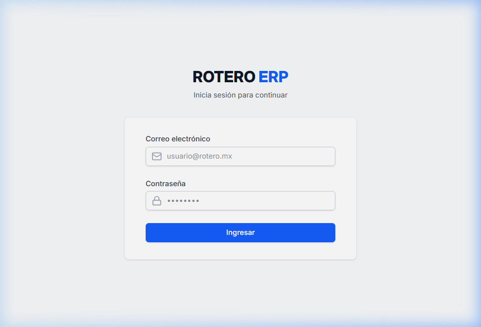
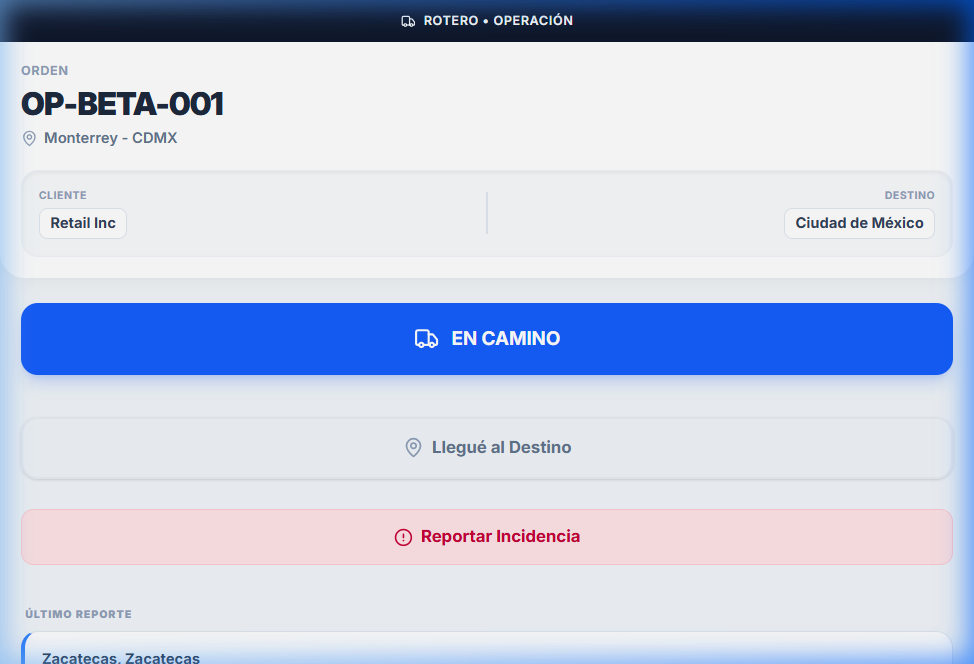
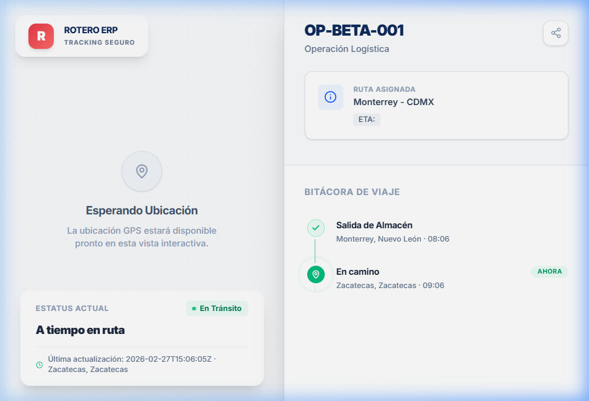

# 🚚 ROTERO ERP – Guía Rápida de la Versión Beta

Bienvenido a la versión **Beta Interactiva** de Rotero ERP. Este documento está diseñado para ayudarte a navegar y demostrar las capacidades del sistema Logístico en vivo (usando el entorno de validación).

---

## 🔗 1. Acceso a la Plataforma Principal (ERP)

Esta es la vista donde actúas como **Administrador** de la plataforma logística (visualizando el CRM, Finanzas, Reportes y monitoreo general).

🔹 **Enlace Principal de la Beta:** [https://roterowlsbeta.netlify.app/](https://roterowlsbeta.netlify.app/)

🔑 **Credenciales de Acceso:**
- **Usuario:** `admin@rotero.app`
- **Contraseña:** `Admin!1234`

Una vez dentro, podrás navegar entre los menús y ver cómo el Dashboard procesa las transacciones simuladas interactivamente.

---

## 📍 2. Demostración del Módulo de Tracking (Seguimiento en Vivo)

Para validar el sistema en tiempo real, puedes simular una operación de viaje abriendo dos enlaces diseñados para distintas perspectivas. La **Operación OP-BETA-001** simula un viaje de _Monterrey_ hacia _Ciudad de México_.

### 📱 Vista del Operador (Chofer)
Esta es la interfaz que el chófer abriría desde un smartphone.
🔹 **Enlace:** [https://roterowlsbeta.netlify.app/driver/7172719e-eb16-484d-a6d6-48ec96b04f37](https://roterowlsbeta.netlify.app/driver/7172719e-eb16-484d-a6d6-48ec96b04f37)

**Instrucción para demo:** 
1. Abre este enlace en tu celular (o en una ventana de PC).
2. Presiona el botón azul gigante **"EN CAMINO"** (*Asegúrate de permitir el acceso a la ubicación si tu dispositivo te lo solicita, así el mapa registrará tus coordenadas reales*).

---

### 🏢 Vista del Cliente Final (Espejo de Rastreo)
Esta es la interfaz pública, es el enlace exacto que podrías enviarle a tu cliente final vía WhatsApp o correo electrónico para que monitoree su carga y vea el recorrido del mapa de forma transparente sin tener que iniciar sesión.

🔹 **Enlace:** [https://roterowlsbeta.netlify.app/t/7bbbcca3-13d7-493c-8e66-17c0a07d29cf](https://roterowlsbeta.netlify.app/t/7bbbcca3-13d7-493c-8e66-17c0a07d29cf)

**Instrucción para demo:** 
1. Abre este enlace en el explorador de tu computadora.
2. Después de mandar un evento "En Camino" o "Llegada" con tu móvil desde la _Vista del Operador_, **actualiza esta pantalla del cliente**. Verás cómo el Pin (📍) aparece exactamente donde estés parado con el teléfono celular.

---

> **Nota:** Todos los módulos cargan de manera optimizada mostrando una transición "skeleton-loading" súper veloz, lo cual puedes experimentar a primera vista. ¡Disfruta la prueba interactiva del sistema de Rotero!
